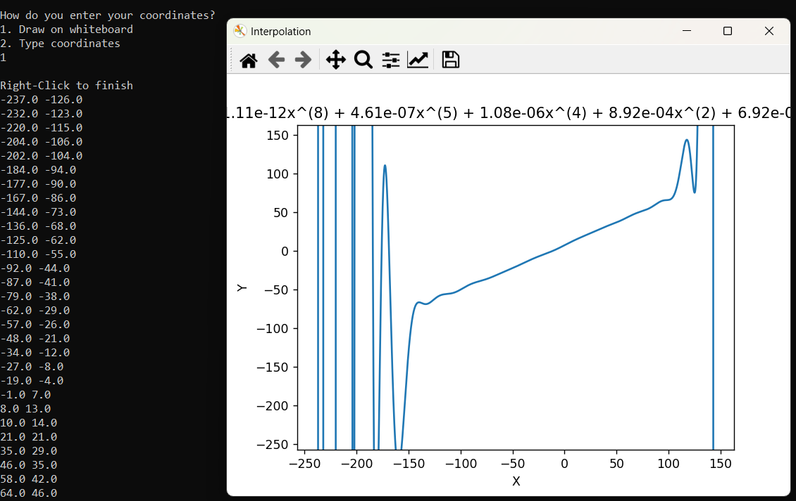

# Interpolation 

This repository contains a Python program that performs [Polynomial Interpolation](https://en.wikipedia.org/wiki/Polynomial_interpolation) using user-defined points. The program allows users to input coordinates either by typing them in or by drawing them on a graphical interface. It utilizes libraries such as `matplotlib` for plotting, `numpy` for numerical operations, and `turtle` for graphical input.

## Features

- **Polynomial Fitting**: Fits a polynomial of a specified degree to the given points.
- **Graphical Input**: Users can draw points using the Turtle graphics library.
- **Text Input**: Users can also input coordinates directly via the console.
- **Dynamic Polynomial Display**: The resulting polynomial is displayed in a readable format.
- **Visualization**: Plots the fitted polynomial along with the original points.

## Installation

To use this program, ensure you have the following libraries installed:

```bash
pip install matplotlib numpy
```
## Usage

1. **Run the Script**: Execute the script in your Python environment.
2. **Choose Input Method**:
   - **Draw on Whiteboard**: Right-click to finish drawing points.
   - **Type Coordinates**: Input coordinates in the format `x y`, one pair per line. Type `end` to finish input.

### Example Input

If you choose to type coordinates, here's how you can input them:
```
1 0
2 1
0 1
3 4
-1 4
-2 9
4 9
end
```





## Important Notes

- The program only accepts points that represent a function; for instance, `(2,3)` and `(2,7)` cannot be used simultaneously.
- The accuracy of the polynomial fitting improves with more input points.


## Key Functions

- **`get_equation(x, y, degr=5)`**: Computes the coefficients of the polynomial that fits the provided (x, y) coordinates using least squares fitting.

- **`getY(x, coef)`**: Evaluates the polynomial at given x-values based on its coefficients.

- **`showFunc(coef)`**: Displays the polynomial function based on its coefficients and returns a `numpy.poly1d` object for further evaluation.

- **`setTitle(coef)`**: Generates a string representation of the polynomial for display in the plot title.

- **`getCoordinates()`**: Collects user-input coordinates until "end" is typed.

- **`tutorial()` & `Tutorial()`**: Provide guidance on how to enter coordinates and important constraints regarding input points.

- **Drawing Functions (`drawShape`, `clicked`, `stopped`)**: Handle user interactions with the turtle graphics window for drawing points.
